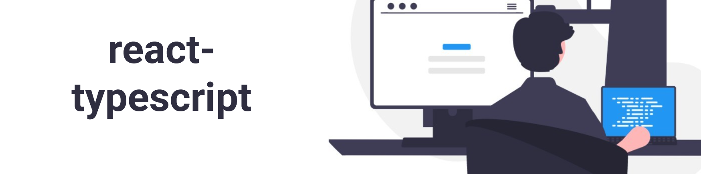

<h2 align="center">
  React Typescript Tutorials
</h2>

## :memo: Índice de tutoriais
1. Getting Started
2. Typing Props
3. Basic Props
4. Advanced Props
5. Event Props
6. Style Props
7. Prop Types and Tips
8. useState Hook
9. useState Future Value
10. useState Type Assertion
11. useReducer Hook
12. useReducer Strict Action Types
13. useContext Hook
14. useContext Future Value
15. useRef Hook
16. Class Component
17. Component Prop
18. Generic Props
19. Restricting Props
20. Template Literals and Exclude
21. Wrapping HTML Elements
22. Extracting a Components Prop Types
23. Polymorphic Components
